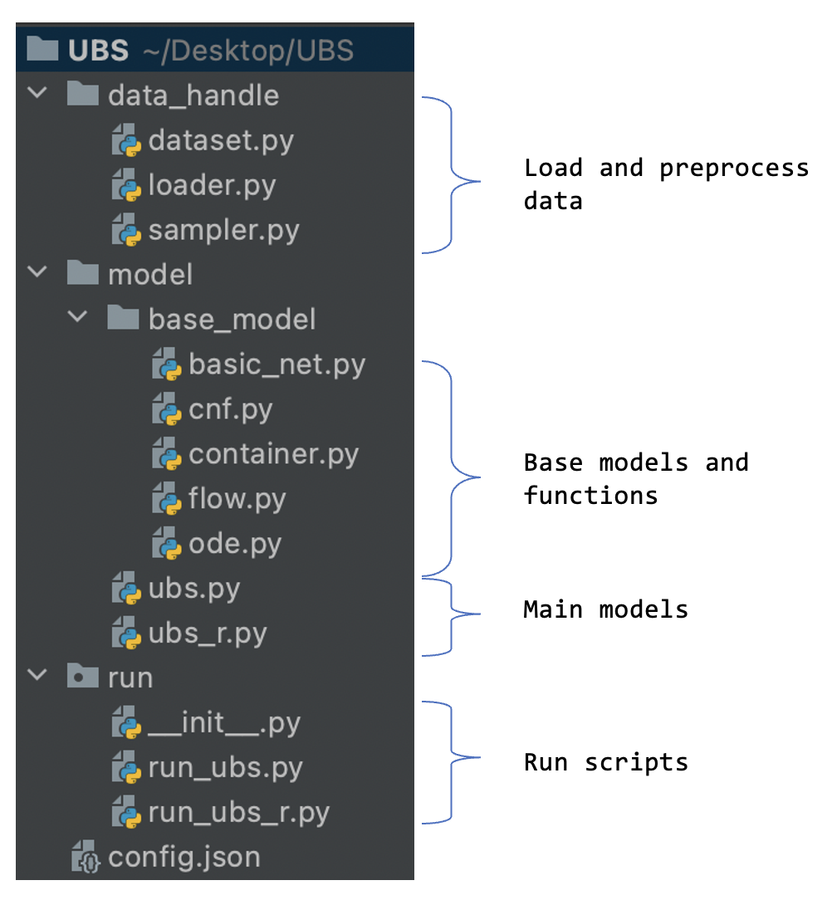

# UBS
This repository contains an implementation of our "Beyond Detection: When, How and Why does an Event Default Happen in Finance?" submit to ICDE 2023.


## Environment Setup

1. Python 3.8.10
2. Pytorch 1.9.0
3. pytorch-lightning  1.5.4
4. torch-geometric  2.0.2
5. torchmetrics  0.5.1
6. torchdiffeq  0.2.2

## Guideline

### data

We provide paysim demo dataset

`data_ubs.pt` is the data for user behavior sequence.

`data_ubs_r.pt` is the data for user behavior sequence with enclosing subgraph.

### project structure

<div align="left">

     

## Configuration

```json
{
  "server": {
    "your server name": {
      "data_path": "your dataset's path",
      "model_path": "the model's save path",
      "result_path": "the result's save path"
    	}
   }
}
```


## Example to run the codes

```
python run/run_ubs.py 
python run/run_ubs_r.py
```


### Citation

If you find the code useful, please wait for our submission result, then cite our paper.


---

